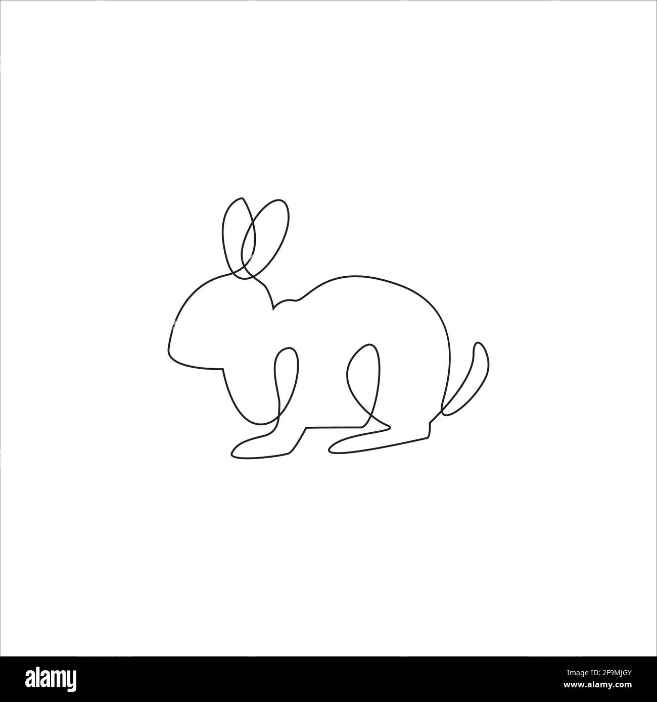

# Titulo 1

## Subtítulo

**Letra en negrita**

*Letra Italica*

>"Block quote"
1. lista
   * Que sera?
   * Que será?
   * Que será-a?
2. Listado
   1. Que será de mi vida?
   1. Que será-a?
3. Listadote
> Otra Cajita
- Otra lista
- Otra mas
- Y una mas

<!-- Nota solo para mi -->

---
Solo es una linea horizontal 

[webpage](https://google.com)

_Italica de nuevo_

__Letra en negrita__

[Link dentro de una sola línea](https://www.google.com)

[Otro link igual pero con un nombre de la página](https://www.google.com "Google's Homepage")

[Solo un link de referencia a otro que vendrá mas abajo][Arbitrary case-insensitive reference text]

[Yo contengo la referencia aun archivo en el repositorio](./img/Rabbit.jpg)

[O puedo usar números para referenciar despúes][1]

O dejarlo vacio y usar [El texto de lik por si solo]. Pero abajo deberás añadir el link.

URLs y URLs con los símbolos de mas que y menos que se convertiran automaticamente en links. 

Por ejemplo: http://www.example.com o <http://www.example.com>.

Some text to show that the reference links can follow later.

[arbitrary case-insensitive reference text]: https://www.mozilla.org
[1]: http://slashdot.org
[El texto de lik por si solo]: http://www.reddit.com

| Tables        | Are           | Cool  |
| ------------- |:-------------:| -----:|
| col 3 is      | right-aligned | $1600 |
| col 2 is      | centered      |   $12 |
| zebra stripes | are neat      |    $1 |

Markdown | Less | Pretty
--- | --- | ---
*Still* | `renders` | **nicely**
1 | 2 | 3

Asi que si escribo y luego pongo dos enters

Se crea una linea nueva como si fuera de otro parrafo

Agregue una linea mas con un pequeño emoji :rage: